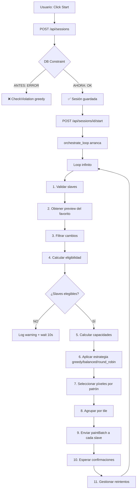

# 🔧 Solución: Error de Estrategia 'greedy' en Base de Datos

## 🐛 Problema Detectado

### Error Principal
```
ERROR:endpoints:DB save session error: (psycopg2.errors.CheckViolation) 
new row for relation "sessions" violates check constraint "sessions_strategy_check"
```

**Causa:** El constraint de la tabla `sessions` solo permitía las estrategias `'balanced'`, `'drain'`, `'priority'`, pero el frontend y el código Python usan `'greedy'` y `'round_robin'`.

### Síntomas
1. ✅ La sesión se crea en memoria
2. ❌ **Falla** al guardar en la base de datos PostgreSQL
3. ⚠️ El orchestrator arranca pero no encuentra la sesión en DB
4. 🚫 **No se envían batches** a los slaves

---

## ✅ Soluciones Implementadas

### 1. **Actualización de Schema SQL** (`init.sql`)

```sql
-- ANTES
CHECK (strategy IN ('balanced', 'drain', 'priority'))

-- DESPUÉS  
CHECK (strategy IN ('balanced', 'drain', 'priority', 'greedy', 'round_robin'))
```

**Archivo:** `/Wplace-AutoBotnet-Server/init.sql` línea 36

---

### 2. **Migración para Bases de Datos Existentes**

**Archivo creado:** `/migrations/001_add_greedy_strategy.sql`

```sql
-- Drop existing constraint
ALTER TABLE sessions DROP CONSTRAINT IF EXISTS sessions_strategy_check;

-- Add new constraint with all strategies
ALTER TABLE sessions ADD CONSTRAINT sessions_strategy_check 
    CHECK (strategy IN ('balanced', 'drain', 'priority', 'greedy', 'round_robin'));
```

---

### 3. **Script de Aplicación Automática**

**Archivo creado:** `/apply_migrations.sh`

```bash
#!/bin/bash
docker-compose exec -T postgres psql -U wplace_user -d wplace_master < migrations/001_add_greedy_strategy.sql
```

---

### 4. **Logs de Debugging Mejorados**

**Archivo:** `/server/session_orchestrator.py`

Se agregaron logs críticos para detectar problemas:

```python
logger.info(f"[orchestrate_loop] Starting orchestration loop for session {session_id}")
logger.debug(f"[orchestrate_loop] Valid slaves: {current_valid_slaves}")
logger.info(f"[orchestrate_loop] After filtering: {len(changes)} changes to process")
logger.warning(f"[planner] No eligible slaves. Need {required_per_slave} charges per slave...")
logger.info(f"[planner] Eligible slaves: {list(eligible_slaves.keys())} with charges {eligible_slaves}")
```

**Beneficios:**
- Detectar cuándo no hay slaves válidos
- Ver cuántos cambios se procesan después del filtrado
- Identificar problemas de elegibilidad (cargas insuficientes)
- Rastrear el flujo completo del orchestrator

---

## 🚀 Cómo Aplicar la Solución

### Opción A: Base de Datos Nueva (Docker Compose)

Si vas a recrear la base de datos desde cero:

```bash
# Detener servicios
docker-compose down

# Borrar volumen de PostgreSQL (CUIDADO: borra todos los datos)
docker volume rm wplace-autobotnet-server_postgres_data

# Recrear con nuevo schema
docker-compose up -d
```

✅ El nuevo `init.sql` se aplicará automáticamente.

---

### Opción B: Base de Datos Existente (Migración)

Si ya tienes datos y no quieres perderlos:

```bash
# 1. Aplicar migración
./apply_migrations.sh

# 2. Verificar que se aplicó correctamente
docker-compose exec postgres psql -U wplace_user -d wplace_master \
  -c "SELECT constraint_name, check_clause FROM information_schema.check_constraints WHERE constraint_name = 'sessions_strategy_check';"
```

**Salida esperada:**
```
      constraint_name      |                                    check_clause                                    
---------------------------+------------------------------------------------------------------------------------
 sessions_strategy_check   | ((strategy)::text = ANY (ARRAY[('balanced'::character varying)::text, ...
```

---

### Opción C: Migración Manual

Si prefieres hacerlo manualmente:

```bash
# Conectar a PostgreSQL
docker-compose exec postgres psql -U wplace_user -d wplace_master

# Ejecutar comandos SQL
ALTER TABLE sessions DROP CONSTRAINT IF EXISTS sessions_strategy_check;
ALTER TABLE sessions ADD CONSTRAINT sessions_strategy_check 
    CHECK (strategy IN ('balanced', 'drain', 'priority', 'greedy', 'round_robin'));

# Verificar
\d sessions

# Salir
\q
```

---

## 🔍 Verificación Post-Migración

### 1. Verificar Constraint

```bash
docker-compose exec postgres psql -U wplace_user -d wplace_master \
  -c "\d sessions"
```

Busca en la salida:
```
Check constraints:
    "sessions_strategy_check" CHECK (strategy::text = ANY (...'greedy'...'round_robin'...))
```

### 2. Probar Creación de Sesión

En el dashboard:
1. Cargar un proyecto JSON
2. Seleccionar slaves
3. Asegurarse que `chargeStrategy` en ConfigPanel sea `"greedy"`
4. Click en **Start**

### 3. Revisar Logs del Servidor

```bash
docker-compose logs -f server
```

**Logs esperados:**
```
[orchestrate_loop] Starting orchestration loop for session <uuid>
[orchestrate_loop] Valid slaves: ['SLV_XXX', 'SLV_YYY']
[orchestrate_loop] After filtering: 150 changes to process
[planner] Eligible slaves: ['SLV_XXX'] with charges {'SLV_XXX': 158}
[planner] strategy=greedy total_capacity=100 plan={'SLV_XXX': 100}
```

✅ **Si ves estos logs, el orchestrator está funcionando correctamente.**

---

## 🐛 Debugging: Problemas Comunes

### Problema 1: "No eligible slaves"

**Log:**
```
[planner] No eligible slaves. Need 120 charges per slave (min=20 + batch=100), have 158 total
```

**Causas:**
- `minChargesToWait` + `pixelsPerBatch` > cargas disponibles por slave
- Configuración: min=20, batch=100 → necesita 120 charges **por slave**

**Solución:**
1. Reducir `pixelsPerBatch` en ConfigPanel (ej: 50 en vez de 100)
2. Reducir `minChargesToWait` (ej: 10 en vez de 20)
3. Esperar a que los slaves acumulen más cargas

### Problema 2: "No changes to process"

**Log:**
```
[orchestrate_loop] After filtering: 0 changes to process
```

**Causas:**
- Preview no tiene cambios (canvas ya está correcto)
- Filtros de color excluyen todos los píxeles
- Slave favorito no envió preview

**Solución:**
1. Verificar que hay píxeles incorrectos en el canvas
2. Revisar filtros de color en ConfigPanel
3. Asegurarse que un slave tiene la estrella ⭐ (favorito)

### Problema 3: "No valid slaves connected"

**Log:**
```
[orchestrate_loop] No valid slaves connected, waiting...
```

**Causas:**
- Los slaves seleccionados se desconectaron
- No hay slaves con el toggle verde en la UI

**Solución:**
1. Reconectar slaves (inyectar Auto-Slave.js)
2. Activar toggles verdes en SlavesPanel
3. Verificar WebSocket en DevTools: Network → WS

---

## 📊 Flujo Completo Corregido



---

## 📝 Estrategias Disponibles

### 1. **greedy** (Recomendada)
- Asigna bloques grandes a slaves con más cargas
- Minimiza número de mensajes WebSocket
- Óptimo para rendimiento

### 2. **balanced**
- Distribución proporcional según cargas
- Todos los slaves participan equitativamente
- Bueno para fairness

### 3. **round_robin**
- Asignación circular pixel por pixel
- Máxima equidad
- Más mensajes WebSocket

### 4. **drain** (Legacy)
- Agota un slave antes de usar el siguiente
- Útil para testing

### 5. **priority** (Legacy)
- Orden fijo de slaves
- No recomendado

---

## ✅ Checklist de Verificación

Después de aplicar la solución:

- [ ] Migración SQL ejecutada sin errores
- [ ] Constraint actualizado en la tabla sessions
- [ ] Logs del orchestrator aparecen en servidor
- [ ] Sesión se guarda en DB sin errores
- [ ] Slaves reciben mensajes `paintBatch`
- [ ] Píxeles se pintan en el canvas
- [ ] Telemetría actualiza `repaired_pixels`

---

## 🎓 Lecciones Aprendidas

1. **Sincronización Schema-Código**: Siempre verificar que los constraints SQL coincidan con los valores usados en el código
2. **Logs Críticos**: Los logs de debugging son esenciales para diagnosticar problemas de orquestación
3. **Migraciones**: Mantener scripts de migración separados de `init.sql` para bases de datos existentes
4. **Testing de Constraints**: Probar todos los valores posibles de enums/checks antes de deploy

---

## 📚 Referencias

- Archivo principal: `/server/session_orchestrator.py`
- Schema SQL: `/init.sql`
- Migración: `/migrations/001_add_greedy_strategy.sql`
- Script: `/apply_migrations.sh`
- Config: `/server/storage.py` (línea 54: `chargeStrategy: "greedy"`)

---

**Fecha:** 1 de octubre de 2025  
**Versión:** 1.0.0  
**Status:** ✅ Resuelto y documentado
